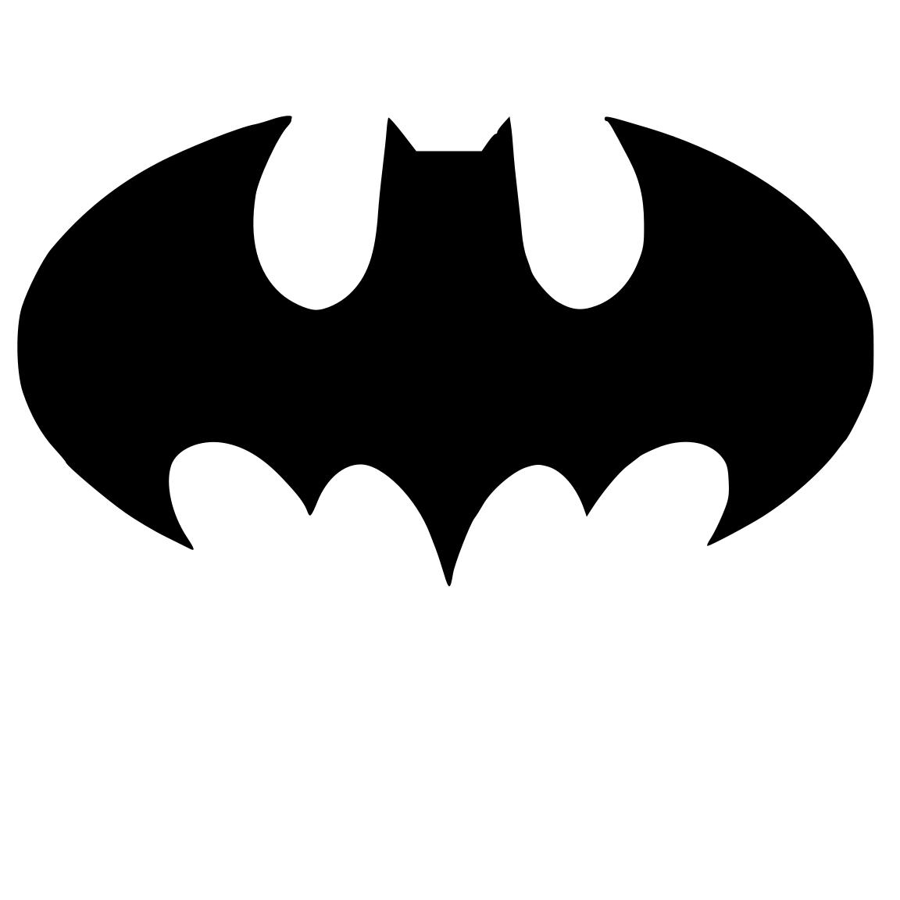
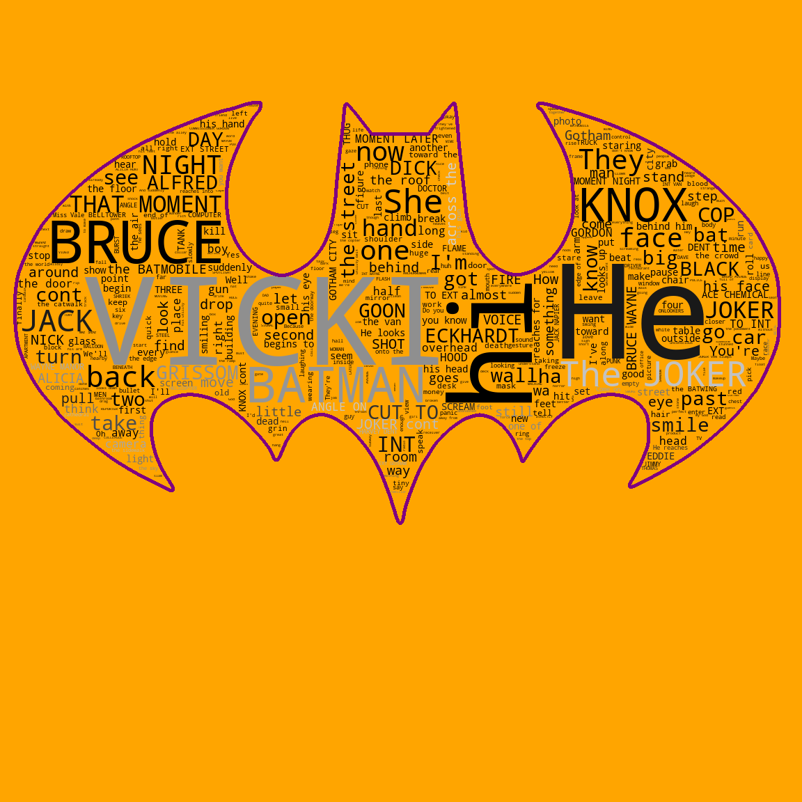
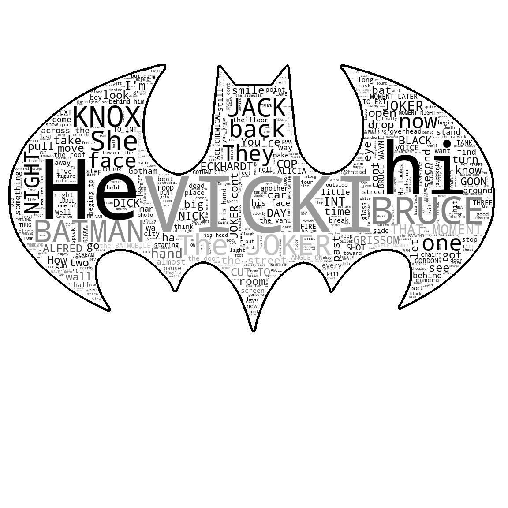
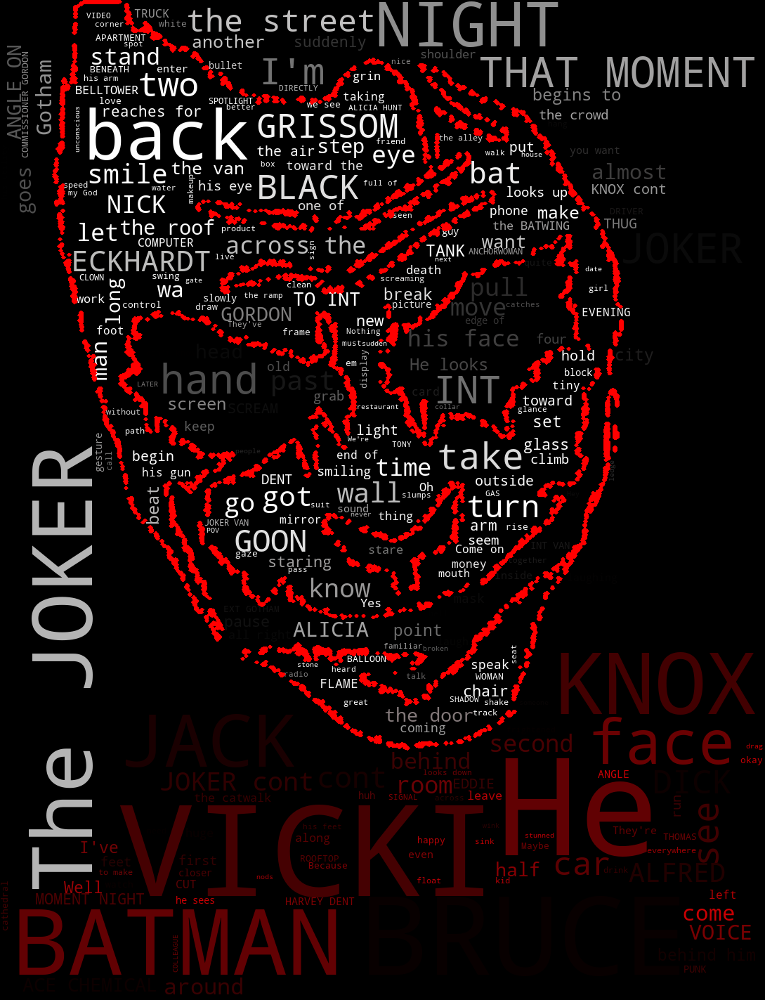
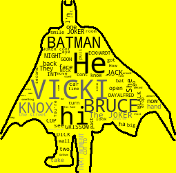

# Batman Wordcloud
###### Creating a Wordcloud based on the script of the movie 'Batman' with Python

### _Step 1 - Import libraries_
###### We'll import some python libraries like WordCloud, matplotlib.pyplot, PIL and numpy for the ceation of our wordcloud.

### _Step 2 - Open text script of batman_
###### Next, we'll open our text script 'batman.txt' having more than 10,000 words in it which is completely based on the movie 'Batman'.  
 
  

 
### _Step 3 - Set the appearance of wordcloud_
###### Now, we'll open our batman png image using numpy library and also set the appearance of the wordcloud like colour, contour, etc.

### _Step 4 - Creation of wordcloud_
###### In this step, we'll create our wordcloud by combining our image and text script according to the appearance we have set.  

### _Step 5 - Plot the wordcloud_
###### Last step involves plotting the wordcloud using matplotlib library.  
 

 
### _Step 6 - Save the generated wordcloud_
###### Eventually, we'll save our generated wordcloud to our pc or device in the png format.
   

  
   

  
 

  
  
